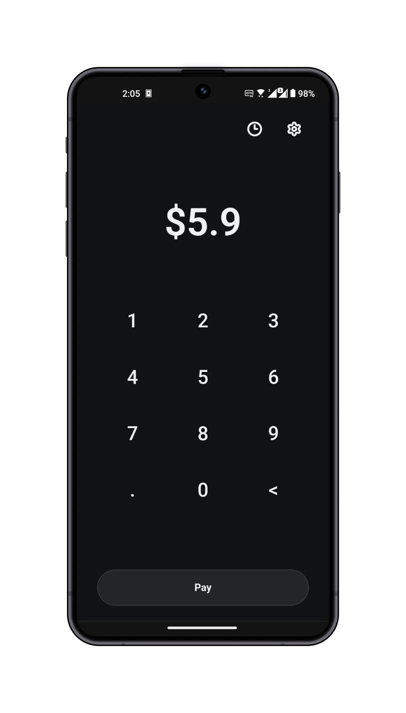
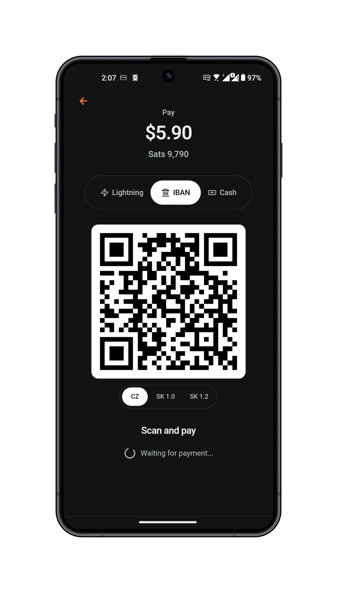
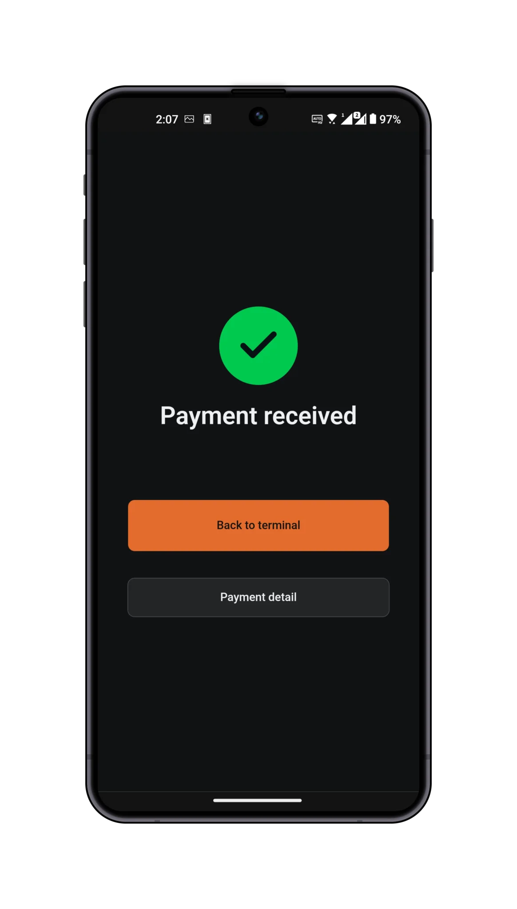

# Payky

Payky is a local-first point-of-sale application for managing terminal checkout
flows, catalog items, bills, payments, account transactions, and background sync
jobs.

The app is built with React, TypeScript, Vite, TanStack Router, Tailwind CSS,
shadcn-style local UI components, Base UI primitives, Zod validation, and Evolu
for persistent application data.

<p>
  
  
  
</p>

## Requirements

- Bun

Install dependencies with exact versions:

```bash
bun install
```

Dependency versions are pinned through Bun. Keep `exact = true` in
`bunfig.toml`.

## Development

Start the Vite dev server:

```bash
bun run dev
```

Build the app:

```bash
bun run build
```

Preview a production build:

```bash
bun run preview
```

## Native Targets

Tauri remains available through the existing scripts:

```bash
bun run tauri:dev
bun run tauri:build
bun run tauri:android:dev
bun run tauri:android:build
```

Capacitor is available as a parallel Android target:

```bash
bun run cap:android:sync
bun run cap:android:dev
bun run cap:android:build
```

Capacitor builds use the native HTTP bridge through `CapacitorHttp` so mobile
requests are not limited by browser CORS behavior.

For Capacitor Android live reload, run:

```bash
bun run cap:android:dev
```

The script starts the HTTP Vite dev server, waits for
`http://127.0.0.1:5173`, forwards the port through Capacitor's Android live
reload flow, and launches the native Android app. The HTTP server is used only
for this debug flow so Android WebView does not reject Vite's self-signed HTTPS
certificate.

The Android release build signs with `payky-release.keystore`. Set these
environment variables before running `bun run cap:android:build`:

```bash
PAYKY_ANDROID_KEYSTORE_PASSWORD=...
PAYKY_ANDROID_KEY_ALIAS=...
PAYKY_ANDROID_KEY_PASSWORD=...
```

## Checks

Run the full validation suite:

```bash
bun run check
```

Run checks individually:

```bash
bun run check:lint
bun run check:ts
bun run check:tests
bun run check:coverage
```

Format files with Biome:

```bash
bun run format
```

Run Vitest in watch mode:

```bash
bun run test:watch
```

## Project Layout

- `src/main.tsx` is the browser entry point.
- `src/App.tsx` wires top-level providers and the TanStack Router provider.
- `src/routes` contains file-based route definitions.
- `src/components/ui` contains reusable shadcn-style UI primitives built on
  Base UI.
- `src/i18n/resources.ts` contains English and Czech translation resources.
- `src/core/evolu` creates the Evolu client and composes the application schema.
- `src/core/modules` contains domain modules for accounts, transactions,
  catalog items, bills, payments, tables, reconciliation claims, settings,
  devices, and Fio integration.
- `bin` contains CLI commands for local data management and background jobs.

## UI Components

Local UI components live in `src/components/ui` and should be imported directly
from their owning module:

```tsx
import { Button } from "@/components/ui/button.tsx"
```

When adding shadcn components, use Bun:

```bash
bunx shadcn@latest add button
```

Keep generic reusable UI in `src/components/ui`; feature and domain logic should
live outside that directory.

## Data Model

Persistent application data is stored through Evolu. Register new tables and
indexes in `src/core/evolu/schema.ts`, and keep domain code in the owning module
under `src/core/modules`.

Domain modules generally use this structure:

- `*-types.ts` for branded ids, enums, unions, and exported domain types.
- Module root files, such as `payment.ts`, for Evolu table schemas and row
  exports.
- `*-actions.ts` for Evolu mutations and command-style operations.
- `*-queries.ts` for reusable Evolu queries and read models.
- `*-utils.ts` for pure helpers.
- `*.test.ts` beside the module it covers.

## CLI

The CLI reads `.env` files automatically. Environment variables are validated at
startup with `@t3-oss/env-core` and Zod.

```bash
PAYKY_SQLITE_PATH=./.data/payky.db bun bin/cli.ts payments list
bun --env-file=.env.cli bin/cli.ts accounts list
```

Supported variables:

- `PAYKY_SQLITE_PATH`: SQLite database file path. Defaults to `.data/payky.db`.

Current runtime caveat: the CLI uses `better-sqlite3`, which may fail under Bun
in environments where Bun does not support that native module. If that happens,
the browser app and Vitest checks can still be run normally through the scripts
above.

## Internationalization

All user-facing React text should come from `src/i18n/resources.ts`. Add keys for
both `en` and `cs`, and use stable, feature-scoped names such as
`checkout.save`, `settings.items.title`, or `activity.empty`.
