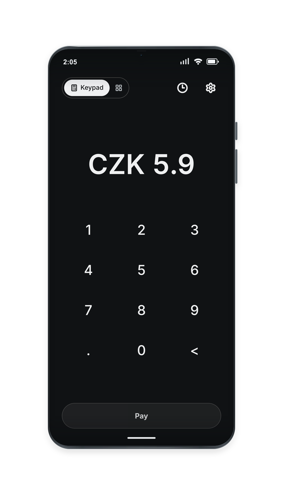
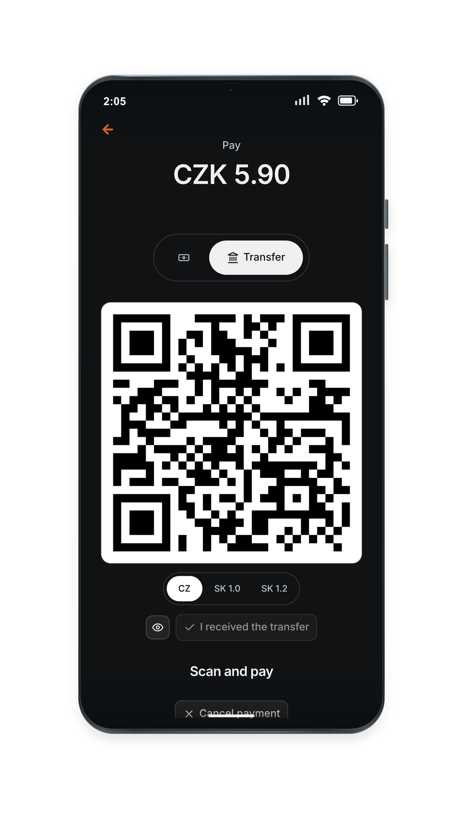
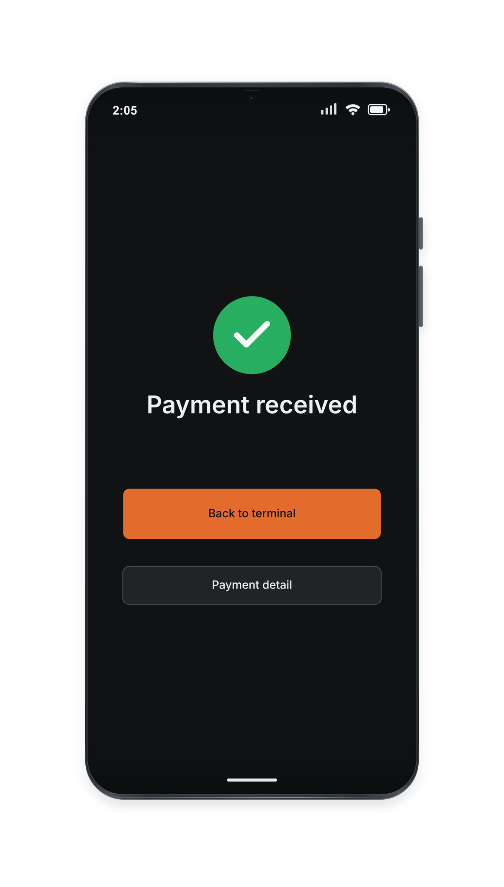

# Payky

Payky is a local-first point-of-sale application for managing terminal bill
flows, catalog items, bills, payments, account transactions, and background sync
jobs.

The app is built with React, TypeScript, Vite, TanStack Router, Tailwind CSS,
shadcn-style local UI components, Base UI primitives, Zod validation, and Evolu
for persistent application data.

<p>
  
  
  
</p>

## Requirements

- Bun

For native iOS development, install Xcode and the Xcode Command Line Tools.
Capacitor 8 targets iOS 15 and newer.

Install dependencies with exact versions:

```bash
bun install
```

Dependency versions are pinned through Bun. Keep `exact = true` in
`bunfig.toml`.

Install the locked Codex skills from `skills-lock.json`:

```bash
bunx skills experimental_install
```

## Development

Start the Vite dev server:

```bash
bun run dev
```

The dev server runs over HTTPS with a self-signed certificate, so the browser
shows a certificate warning (`ERR_CERT_AUTHORITY_INVALID`, issuer
`example.org`) that embedded IDE browsers cannot bypass. To get rid of it,
create a locally trusted certificate once with [mkcert](https://github.com/FiloSottile/mkcert):

```bash
brew install mkcert
mkcert -install
mkcert -cert-file .certs/localhost.pem -key-file .certs/localhost-key.pem localhost 127.0.0.1 ::1
```

`bun run dev` and `bun run preview` pick up `.certs/` automatically (it is
gitignored) and fall back to the self-signed certificate when it is missing.
Alternatively, `PAYKY_DISABLE_BASIC_SSL=1 bun run dev` serves plain
`http://localhost:5173`, which browsers still treat as a secure context.

Build the app:

```bash
bun run build
```

Preview a production build:

```bash
bun run preview
```

## Native Targets

Capacitor is available as the Android native target:

```bash
bun run cap:android:sync
bun run cap:android:dev
bun run cap:android:build
bun run cap:ios:sync
bun run cap:ios:run
bun run cap:ios:open
```

Capacitor builds use the native HTTP bridge through `CapacitorHttp` so mobile
requests are not limited by browser CORS behavior.

For Capacitor Android live reload, run:

```bash
bun run cap:android:dev
```

The script starts the HTTP Vite dev server, waits for
`http://127.0.0.1:5173`, forwards the port through Capacitor's Android live
reload flow, and launches the native Android app. The HTTP server is used only
for this debug flow so Android WebView does not reject Vite's self-signed HTTPS
certificate.

For Capacitor iOS simulator development, run:

```bash
bun run cap:ios:run
```

For Xcode-driven iOS development, run:

```bash
bun run cap:ios:sync
bun run cap:ios:open
```

Configure the signing team, bundle identifier, provisioning profile, display
name, icons, launch screen, and deployment target in Xcode. The default bundle
identifier is `me.payky`.

For iOS live reload on a physical iPhone, start Vite on the local network in one
terminal:

```bash
PAYKY_DISABLE_BASIC_SSL=1 bun run dev -- --host 0.0.0.0 --strictPort
```

Then point Capacitor at the Mac LAN URL from another terminal:

```bash
PAYKY_CAPACITOR_SERVER_URL=http://<mac-lan-ip>:5173 bunx cap run ios
```

The iPhone and Mac must be on the same network. iOS does not have an `adb
reverse` equivalent, so a physical device cannot use `localhost` to reach the
Mac dev server.

The Android release build signs with `payky-release.keystore`. Set these
environment variables before running `bun run cap:android:build`:

```bash
PAYKY_ANDROID_KEYSTORE_PASSWORD=...
PAYKY_ANDROID_KEY_ALIAS=...
PAYKY_ANDROID_KEY_PASSWORD=...
```

## Checks

Run the full validation suite:

```bash
bun run check
```

Run checks individually:

```bash
bun run check:lint
bun run check:ts
bun run check:tests
bun run check:coverage
```

Format files with Biome:

```bash
bun run format
```

Run Vitest in watch mode:

```bash
bun run test:watch
```

## Project Layout

- `src/main.tsx` is the browser entry point.
- `src/App.tsx` wires top-level providers and the TanStack Router provider.
- `src/routes` contains file-based route definitions.
- `src/components/ui` contains reusable shadcn-style UI primitives built on
  Base UI.
- `src/i18n/resources.ts` contains English and Czech translation resources.
- `src/core/evolu` creates the Evolu client and composes the application schema.
- `src/core/modules` contains domain modules for accounts, transactions,
  catalog items, bills, payments, tables, reconciliation claims, settings,
  devices, and Fio integration.
- `bin` contains CLI commands for local data management and background jobs.

## UI Components

Local UI components live in `src/components/ui` and should be imported directly
from their owning module:

```tsx
import { Button } from "@/components/ui/button.tsx"
```

When adding shadcn components, use Bun:

```bash
bunx shadcn@latest add button
```

Keep generic reusable UI in `src/components/ui`; feature and domain logic should
live outside that directory.

## Data Model

Persistent application data is stored through Evolu. Register new tables and
indexes in `src/core/evolu/schema.ts`, and keep domain code in the owning module
under `src/core/modules`.

Domain modules generally use this structure:

- `*-types.ts` for branded ids, enums, unions, and exported domain types.
- Module root files, such as `payment.ts`, for Evolu table schemas and row
  exports.
- `*-actions.ts` for Evolu mutations and command-style operations.
- `*-queries.ts` for reusable Evolu queries and read models.
- `*-utils.ts` for pure helpers.
- `*.test.ts` beside the module it covers.

## Account Seed and Key Derivation

Each device account has a 128-bit master secret `S` (the `MasterKey`). For a
path `P`, derive a child key and independent 32-byte entropy:

```text
R = BIP32.MasterKey(S)
K = BIP32.Derive(R, P)
E = HMAC-SHA512(
  key = "bip-entropy-from-k",
  message = K.privateKey
)[0:32]
```

Payky paths follow [BIP-85](https://github.com/bitcoin/bips/blob/master/bip-0085.mediawiki)
with the BIP-39 application: `m/83696968'/39'/{language}'/{words}'/{index}'`,
language `0'` = English. The word count encodes how much of `E` the consumer
uses (24 words = 32 bytes, 12 words = 16 bytes). The paths must never change
after accounts exist.

| Consumer | Path `P` | Result |
| --- | --- | --- |
| Cashu wallet (shared with Linky) | `m/83696968'/39'/0'/24'/0'` | `E` as BIP-39 entropy → 24-word mnemonic → `mnemonicToSeed` (empty passphrase) as the 64-byte wallet seed |
| Evolu master owner | `m/83696968'/39'/0'/24'/1'` | `E` as the 32-byte Evolu owner secret |
| Linky Evolu owner (shared with Linky) | `m/83696968'/39'/0'/24'/1'/0'` | `E[0:16]` as BIP-39 entropy → 12-word mnemonic → Linky's Evolu app owner |
| Nostr key (shared with Linky) | `m/44'/1237'/0'/0/0` | NIP-06: the node's private key itself, no BIP-85 step |
| Default Spark wallet | `m/83696968'/39'/0'/12'/0'` | `E[0:16]` as the 16-byte Spark wallet secret |

The Spark wallet secret is stored as hex and used as BIP-39 entropy: wallet
initialization and the settings UI encode it as a 12-word mnemonic (never the
raw secret), so the wallet can also be restored in any BIP-39-compatible Spark
client.

### The Linky account

The Cashu wallet path, the Linky owner path and the Nostr path are the ones
[Linky](https://github.com/gorrdy/linky) uses, so a merchant who restores
Payky from the 20 words of their Linky account is the same user in both apps:

- **One ecash inventory.** Payky opens Linky's own synced data — the
  `@linky/linksync` shard store over Linky's Evolu app owner, on Linky's relay
  (`wss://evolu.linky.fit`) — and the cashu wallet reads and writes its proofs
  there. The balance and the tokens are identical in both apps; nothing is
  copied. Linky runs Evolu 7 and its relay is pinned to it, while Payky's own
  data lives on Evolu 8 (a different wire encoding), so the Linky store runs a
  second Evolu client from the `@evolu-v7/*` npm aliases (`src/core/linky/`).
  **Restore from mint** (Settings › Payment Accounts › Cashu) recovers proofs
  neither app has stored. The default mint is Linky's main mint,
  `https://cashu.cz`; it is a per-account setting.
- **One Nostr identity and profile.** Settings shows, at the top, the account
  Linky shows: the active npub (derived from the phrase, or the key the user
  pasted into Linky — Linky syncs it in the identity shard, and Payky reads
  that row first) and the published Nostr profile name and picture. Until a
  profile is published the card shows the Payky icon and asks for a name.
  Tapping the card opens Settings › Profile, where the name and picture (from
  the gallery, scaled to a small JPEG data URL) are edited and republished as
  the kind-0 event with the active key; every other field of the published
  profile is kept.
- **One bitcoin QR.** The payment screen has a single bitcoin tab. With Spark
  and cashu both enabled it shows a BIP-321 `bitcoin:` uri whose `lightning`
  parameter is the mint's invoice and whose `spark` parameter is the Spark
  invoice, so a Lightning wallet settles into cashu and a Spark wallet over
  Spark; with one method enabled it shows that method's bare invoice.
- **Onboarding** is a start screen with two ways in — create a new account,
  or restore one with its 20 words (from Payky or Linky) — followed by a
  single question: the bank account, as a Czech or Slovak account number or
  an IBAN, with the bank named from its code as a check, and skippable. The
  language follows the device, the legal entity starts Czech (non-VAT) and
  the currency CZK; bank transfer (once an account exists) and bitcoin over
  cashu are on from the start, cash and Spark are enabled in Settings. Sync
  is on for every account from its first launch (`wss://free.evoluhq.com`
  for Payky's own Evolu 8 data; Linky's relay speaks Evolu 7 and carries only
  the shared Linky store). The Spark account accepts the 12 words of a
  wallet used elsewhere (Wallet of Satoshi, Bitlifi, …) so payments land
  there.
- Both apps mint under the same cashu seed with their own device-local
  counters, which the wallet library recovers from (NUT-09 reclaim).

`S` itself is backed up as a single [SLIP-39](https://github.com/satoshilabs/slips/blob/master/slip-0039.md)
20-word recovery mnemonic (`src/core/modules/shared/key-derivation.ts`, via
the `slip39-ts` library), encoded as one group with a 1-of-1 threshold — there
is currently no multi-share Shamir splitting, so the phrase is the sole backup
of `S` and must be treated with the same care as a BIP-39 seed phrase. SLIP-39
mnemonics use their own wordlist and checksum and are not interchangeable with
BIP-39 mnemonics. The mnemonic's identifier (SLIP-39's 15-bit metadata field)
is derived deterministically from `S` via HMAC-SHA512 rather than randomized,
so encoding the same `S` always produces the same recovery phrase. 256-bit
master keys and their 33-word recovery mnemonics are not supported.

## CLI

The CLI reads `.env` files automatically. Environment variables are validated at
startup with `@t3-oss/env-core` and Zod.

```bash
PAYKY_SQLITE_PATH=./.data/payky.db bun bin/cli.ts payments list
bun --env-file=.env.cli bin/cli.ts accounts list
```

Supported variables:

- `PAYKY_SQLITE_PATH`: SQLite database file path. Defaults to `.data/payky.db`.

Current runtime caveat: the CLI uses `better-sqlite3`, which may fail under Bun
in environments where Bun does not support that native module. If that happens,
the browser app and Vitest checks can still be run normally through the scripts
above.

## Internationalization

All user-facing React text should come from `src/i18n/resources.ts`. Add keys for
both `en` and `cs`, and use stable, feature-scoped names such as
`bill.save`, `settings.items.title`, or `activity.empty`.
